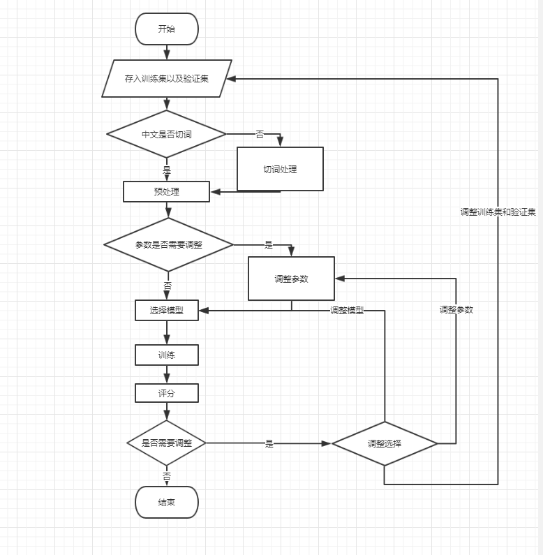
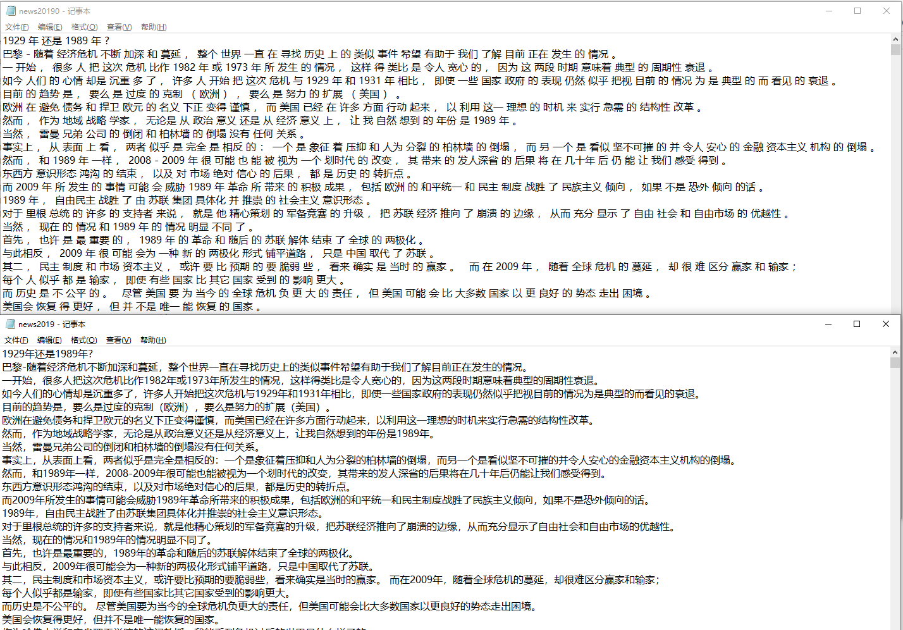
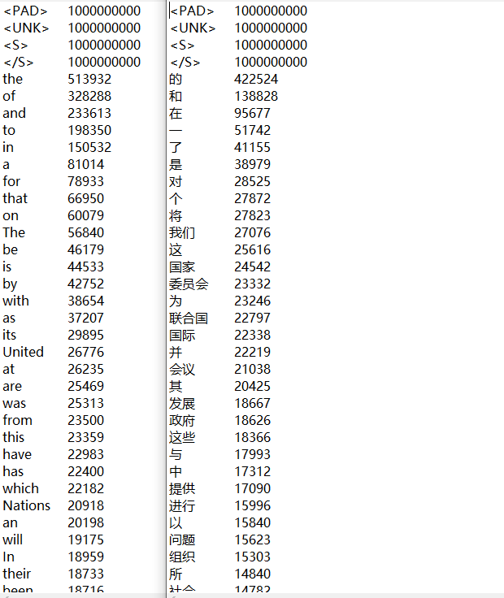
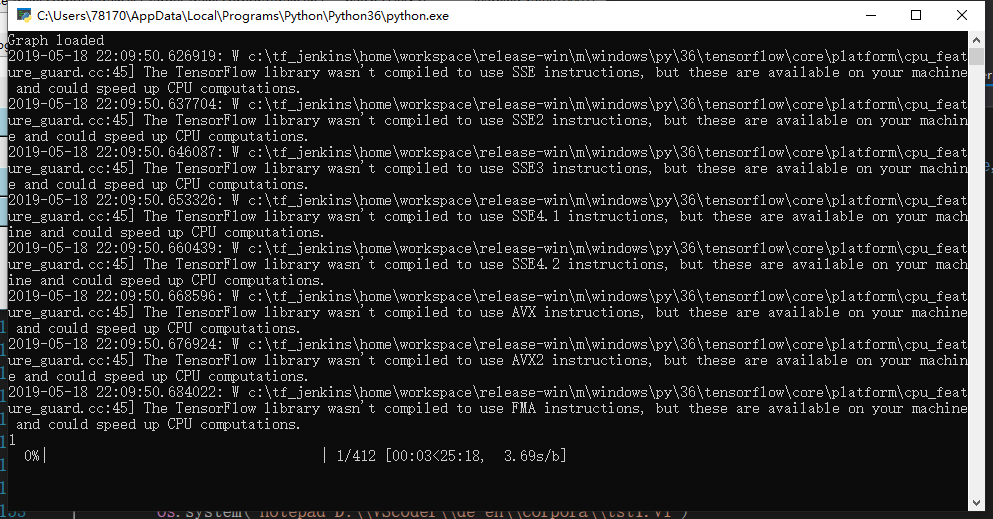
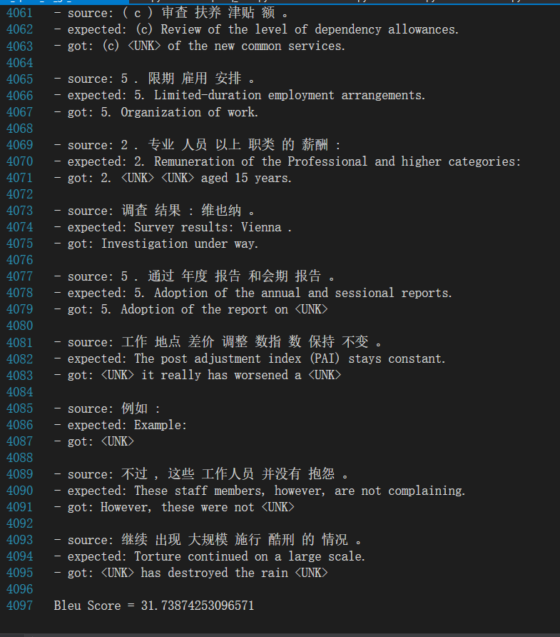
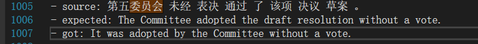
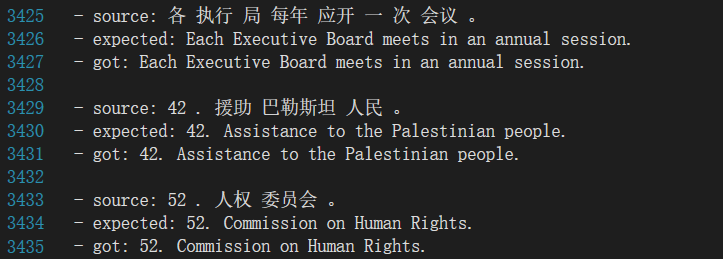
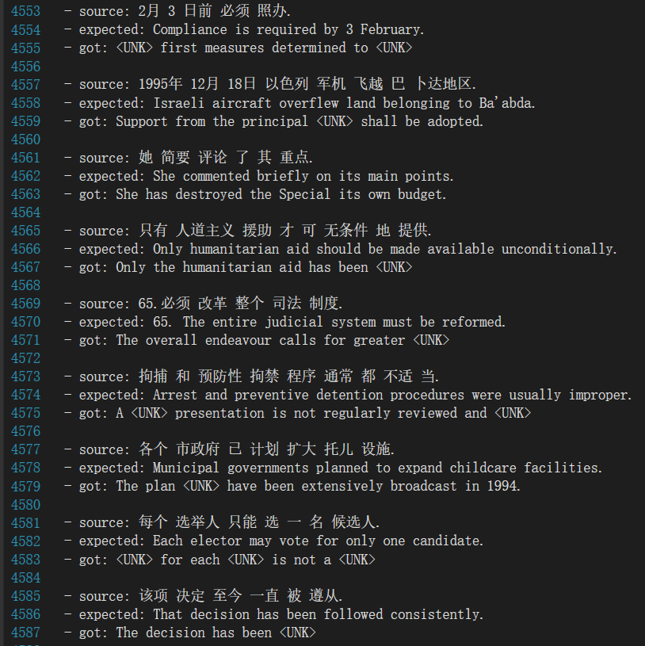
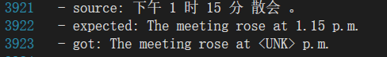

# Translator_CH-EN   
This is a Chinese-English Translator demo, refferred to the thesis:[Attention Is All You Need](https://arxiv.org/abs/1706.03762).    
I tried to build rebuild a model as the thesis mentioned, and make a simple user interface for the application, the UI like this:   

  

The system run as following system flow chart:   

  

For chinese Translator, we need to add word_segmentation function to unified sentence structure, as following picture:   

  

Then, we need preprocess as other kind of Translator(Count the number of occurrences of each word):   

  

After that, we can train the model:   

  

The total result:   

  

We could get some translation as following(similar meaning in different result, but ignore draft):   

  

Good result for some sentences that have appeared or stereotyped expression:   

  

However, the application had some problems with the punctuation, time and number:   

  

  

This problem can be solved if you add a function to find all punctuations, times and numbers in preprocess function. If you want to have better result, please add that yourself.
